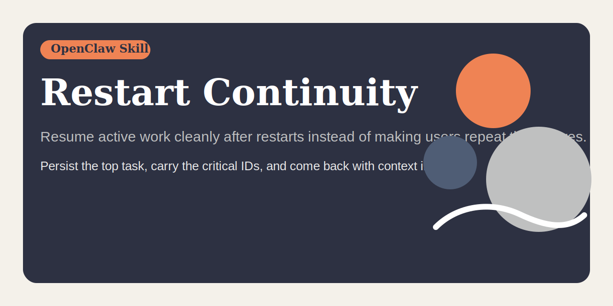

# Restart Continuity




Preserve and resume in-flight OpenClaw work across gateway restarts without amnesia.

## Quick pitch

Resume active work cleanly after restarts instead of making users repeat themselves.
Persist the top task, carry the critical IDs, and come back with context intact.

## Why this exists

Restarts should not erase context. When a gateway restarts mid-task, agents often forget what they were doing and require the user to manually remind them to continue. That is sloppy, annoying, and completely avoidable.

OpenClaw has built-in post-restart pings, but that alone is not enough for reliable recovery. A serious workflow needs disciplined state capture before restart and proactive resumption after restart.

`restart-continuity` provides that discipline.

It gives an agent a focused workflow for:

- persisting the top active task before restart
- recording the IDs that matter after restart
- scheduling a fallback nudge for intentional restarts
- resuming the correct task first after restart
- proactively telling the user what resumed

## Works independently

`restart-continuity` is useful on its own.

Use it even if you do not adopt broader multitask orchestration or state-sync skills. On its own, it already improves:

- restart preparation
- post-restart recovery accuracy
- fallback cron handling
- continuity of the top active task
- proactive user updates after restart

Other repos may complement it, but they are not required for this repo to make sense.

## Family role

Within this repo family, `restart-continuity` is the restart-boundary specialist.

Use it when the core failure happens at the restart boundary: preserving the top task, carrying the critical IDs across restart, and proactively resuming the right lane first.

Do not bloat it into general state maintenance. If the main problem is ongoing drift between `TODO.md` and `memory/active-task.md` during live work, that belongs to `task-state-sync`. If the main problem is the whole multitask operating model, that belongs to `multi-task-continuity`.

## What the skill teaches

The skill tells the agent to:

- update `memory/active-task.md` before restart with goal, status, blockers, next action, and user-facing restart message
- record live IDs such as approvals, job IDs, sessions, processes, ports, and file paths
- schedule a one-shot cron fallback for intentional restarts and store its `jobId`
- resume the top unfinished task immediately after restart when safe
- tell the user in the first substantive reply what resumed and what happens next
- clear stale fallback state after successful resumption

## When to use it

Use `restart-continuity` when:

- a task spans restarts, planned or unplanned
- a gateway restart is planned and work should survive it
- the assistant must proactively continue the pre-restart task
- critical IDs need to survive the restart boundary
- a long-running workflow cannot afford restart amnesia

## Example behavior

### Example 1: planned restart during active work

A gateway restart is required while a repo publish task is still in progress.

A good agent should:

1. update `memory/active-task.md` with the real top task
2. record the important IDs and exact next step
3. schedule the fallback cron job
4. write the fallback `jobId` into `memory/active-task.md`
5. restart only after the recovery trail is real

### Example 2: post-restart recovery

The gateway comes back after an intentional restart.

A good agent should:

1. read `memory/active-task.md` before unrelated work
2. resume the top unfinished task immediately if safe
3. send the queued user-facing restart update in the first substantive reply
4. remove the fallback cron job after confirming successful resumption

### Example 3: task completion after restart

The resumed task finishes cleanly after restart.

A good agent should:

1. clear `memory/active-task.md` if no top task remains
2. or rewrite it if another unfinished task becomes primary
3. avoid leaving stale restart IDs and outdated next steps behind

## Related skills

These are related, not required:

- `task-orchestrator`: adds multitask scheduling and prioritization — <https://github.com/ruanrrn/task-orchestrator>
- `task-state-sync`: keeps continuity files accurate during live work — <https://github.com/ruanrrn/task-state-sync>
- `multi-task-continuity`: bundles orchestration, state sync, and restart-safe recovery — <https://github.com/ruanrrn/multi-task-continuity>

If restart recovery is the main pain, use this repo alone.

## Social preview

Suggested social preview asset: `assets/social-preview.svg`

Suggested one-line copy:

> Resume active work cleanly after restarts instead of making users repeat themselves.

GitHub note:

- The current `gh` CLI and GraphQL `UpdateRepositoryInput` do not expose a writable custom social preview field.
- To use this image as the repository social preview, upload `assets/social-preview.svg` manually in the repo settings UI.

## What you get

- `restart-continuity/` - the skill source
- `dist/restart-continuity.skill` - packaged artifact ready to import

## Install

Use either path:

1. Import `dist/restart-continuity.skill` into an OpenClaw environment.
2. Copy `restart-continuity/` into your skills directory if you want the editable source.

## Repository layout

```text
restart-continuity/
├── LICENSE
├── README.md
├── CONTRIBUTING.md
├── assets/
│   └── social-preview.svg
├── restart-continuity/
│   └── SKILL.md
└── dist/
    └── restart-continuity.skill
```

## Contributing

See `CONTRIBUTING.md` for contribution scope, PR expectations, and how to keep this repo focused on restart-safe recovery instead of turning it into a generic continuity junk drawer.

## Release hygiene

- Regenerate `dist/restart-continuity.skill` after each material skill change
- Keep the repository description aligned with the skill trigger language
- Keep the repo narrow and practical; no unrelated debug junk

## Repository

- GitHub: `https://github.com/ruanrrn/restart-continuity`
- License: MIT
